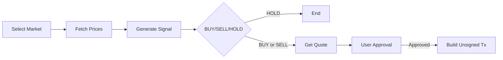

# PulseFlow Trader

A Solana trading workflow with a clear signal engine and a manual approval gate before transaction creation.

## Requirements

System:
- Linux, macOS, or Windows (WSL also works)
- Internet access for Birdeye and Jupiter API calls

Runtime:
- Python 3.10+
- `uv` (recommended) or `pip`

Environment variables:
- `BIRDEYE_API_KEY` (required)

Python packages:
- `langchain>=0.3.0`
- `langchain-openai>=0.2.0`
- `langgraph>=0.2.0`
- `python-dotenv>=1.0.0`
- `requests>=2.31.0`

## Project layout

```text
.
├── app
│   ├── __init__.py
│   ├── graph.py
│   └── tools.py
├── docs
│   └── diagram.md
├── main.py
├── pyproject.toml
└── requirements.txt
```

## Architecture

See full diagram: `docs/diagram.md`

Quick view:



## How the signal works

The strategy reads hourly prices and computes:

- fast average: recent 6 points
- slow average: recent 24 points
- volatility score: average absolute return on the last 20 intervals

Rules:

- BUY: fast trend above slow trend, price above slow average, low volatility
- SELL: fast trend below slow trend, price below slow average
- HOLD: no clear edge

## Setup

1. Install dependencies (uv)

```bash
uv sync
```

Alternative with pip:

```bash
python -m venv .venv
source .venv/bin/activate
pip install -r requirements.txt
```

2. Add your Birdeye key in `.env`

```env
BIRDEYE_API_KEY=your_key_here
```

## Run

With uv:

```bash
uv run python main.py
```

With venv + pip:

```bash
python main.py
```

## Notes

- The app creates unsigned swap transactions only.
- The flow pauses and asks for approval before transaction build.
- Use small values and test wallets if you extend this.
