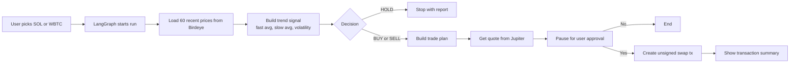

# PulseFlow Trader Diagram

```mermaid
flowchart LR
    A[User picks SOL or WBTC] --> B[LangGraph starts run]
    B --> C[Load 60 recent prices from Birdeye]
    C --> D[Build trend signal\nfast avg, slow avg, volatility]
    D --> E{Decision}
    E -->|HOLD| F[Stop with report]
    E -->|BUY or SELL| G[Build trade plan]
    G --> H[Get quote from Jupiter]
    H --> I[Pause for user approval]
    I -->|No| J[End]
    I -->|Yes| K[Create unsigned swap tx]
    K --> L[Show transaction summary]
```
